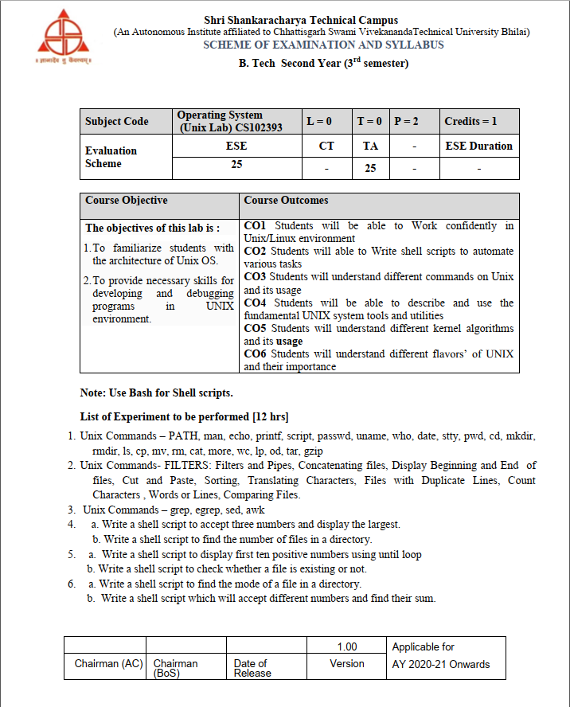
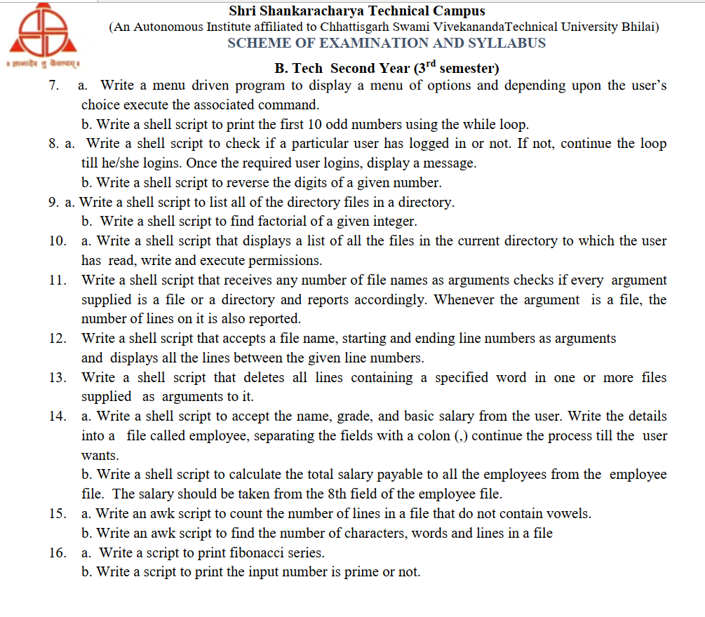

# Unix lab

---

## Setup option

1. [Download](https://brave.com/?mtm_source=www.google.com&mtm_medium=cpc&mtm_campaign=brand&mtm_content=all&ref=UJW151&gclid=Cj0KCQjwhL6pBhDjARIsAGx8D59HcSPazIM1gRmaHIw1PdyUDcd2nndXJrYnoeXyMgb_nYWWfbaBvuYaAuE7EALw_wcB) brave browser to block ad, because chrome ad blocker wont help you.

1. Go to [onworks](https://www.onworks.net/), but remember this tool does not give root user access, but good for exploring linux/Unix OS

1. select ubuntu => start => enter

1. change dark mode: go to settings => appearance => dark

1. increase font size: go to settings => accessibility => Large text

1. open terminal

## Basic cmd
