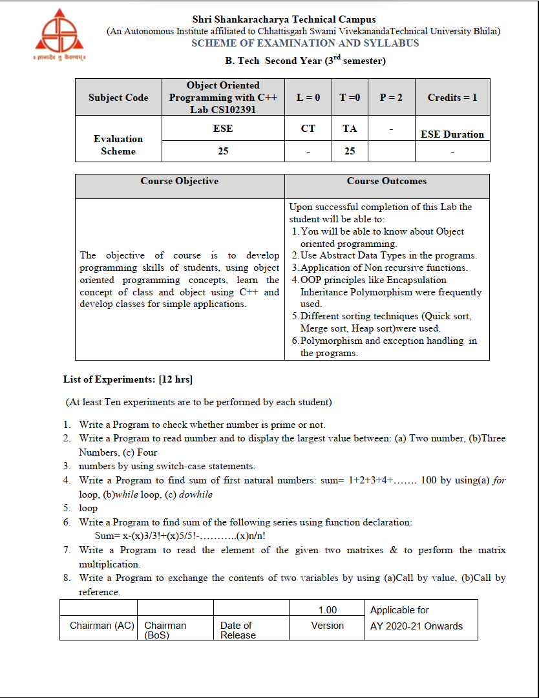

# Object Oriented Programming with C++, Lab CS102391

   
  
<br>
<br>

## 1. Write a Program to check whether number is prime or no

A prime number is a natural number that has only one and itself as factors. This C++ program used to demonstrates how to find out whether a natural number is prime or not.

Examples: 2, 3, 13 are prime numbers.

- [how to find prime number 1-100 ](https://www.youtube.com/shorts/uPpLTegQ6Nc)

```c++
#include <iostream>
using namespace std;

int main() {

  int i, n;
  bool is_prime = true;

  cout << "Enter a positive integer: ";
  cin >> n;

  // 0 and 1 are not prime numbers
  if (n == 0 || n == 1) {
    is_prime = false;
  }

  // loop to check if n is prime
  for (i = 2; i <= n/2; ++i) {
    if (n % i == 0) {
      is_prime = false;
      break;
    }
  }

  if (is_prime)
    cout << n << " is a prime number";
  else
    cout << n << " is not a prime number";

  return 0;
}

```

## 2. Write a Program to read number and to display the largest value between:

(a) Two number

```c++
// C++ Program to Find Largest of Two Numbers
#include <iostream>
using namespace std;
int main(){
    int x, y;

    // Asking for input
    cout << "Enter the first number: ";
    cin >> x;
    cout << "Enter the second number: ";
    cin >> y;

    if (x > y){
        cout << x << " is greater than " << y;
    }
    else if (y > x){
        cout << y << " is greater than " << x;
    }
    else{
        cout << "Both are equal";
    }
    return 0;
}
```

---

(b)Three Numbers

```c++
// C++ Program to Find Largest of Three Numbers

#include <iostream>
using namespace std;

int main() {

    double n1, n2, n3;

    cout << "Enter three numbers: ";
    cin >> n1 >> n2 >> n3;

    // check if n1 is the largest number
    if(n1 >= n2 && n1 >= n3)
        cout << "Largest number: " << n1;

    // check if n2 is the largest number
    else if(n2 >= n1 && n2 >= n3)
        cout << "Largest number: " << n2;

    // if neither n1 nor n2 are the largest, n3 is the largest
    else
        cout << "Largest number: " << n3;

    return 0;
}
```

---

(c) Four

```c++
// C++ Program to Find Largest of Four Numbers

#include <iostream>
using namespace std;
int max(int x, int y){
    if(x > y){
        return x;
    }else{
        return y;
    }
}
int main(){
    double n1, n2, n3, n4;

    cout << "Enter three numbers: ";
    cin >> n1 >> n2 >> n3 >> n4;

    int a = 75, b = 18, c = 25, d = 98;
    int left_max = max(n1, n2);
    int right_max = max(n3, n4);
    int final_max = max(left_max, right_max);
    cout << "Largest number: " << final_max;
}
```
