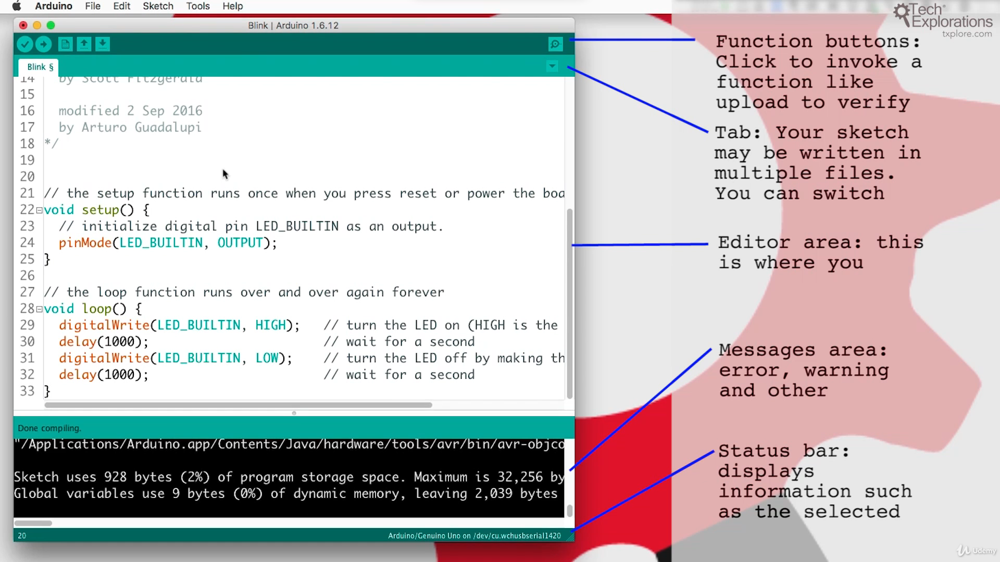
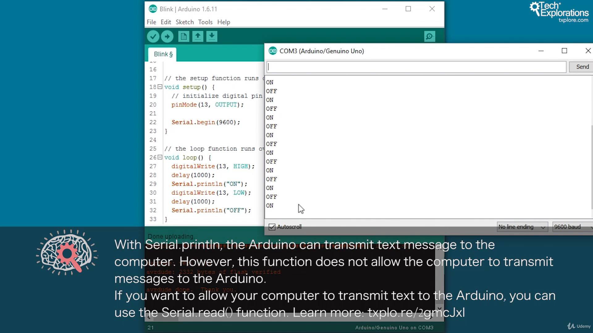
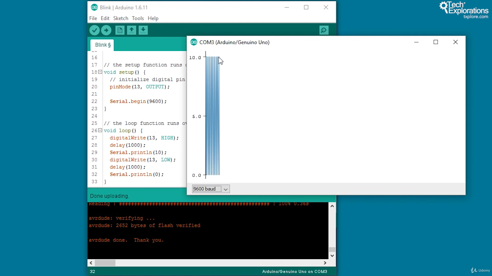

## 1. Introduction to various sensors and actuators.

a) PIR Motion Sensor. <br>
b) Rain Drop Sensor. <br>
c) Moisture Sensor. <br>
d) Temperature Sensor. <br>
e) Touch Sensor. <br>
f) Infrared Sensor. <br>
g) RFID Sensor. <br>
h) Ultrasonic Sensor. <br>
i) Bluetooth Module. <br>
j) Wi-Fi Module. <br>
k) LED/OLED. <br>
l) Servo Motor. <br>

<br>
<br>

### Ardunio uno specification

- Specification [Click me](https://docs.arduino.cc/hardware/uno-rev3/#tech-specs)

<br>

### Where to download arduino IDE

- Download Arduino IDE [Click me](https://www.arduino.cc/en/software)

<br>

### How to Select sketch

- From menu select file--> example--> digital--> BlinkwithoutDelay

<br>

### The Arduino IDE - Understanding the Preferences pane<a id="55"></a>



<br>

### How to upload a sketch to your Arduino<a id="57"></a>

- go to menu Files--> Example--> basic--> blink
- go to menu Tools--> Boards--> arduino avr board--> arduino uno
- go to menu Tools--> Port--> COM(arduino)

```ino

// the setup function runs once when you press reset or power the board
void setup() {
  // initialize digital pin LED_BUILTIN as an output.
  pinMode(LED_BUILTIN, OUTPUT);
}

// the loop function runs over and over again forever
void loop() {
  digitalWrite(LED_BUILTIN, HIGH);  // turn the LED on (HIGH is the voltage level)
  delay(1000);                      // wait for a second

  digitalWrite(LED_BUILTIN, LOW);  // turn the LED off by making the voltage LOW
  delay(1000);                     // wait for a second
}

```

- click on ✅ to compile, then ➡️ to upload sketch on uno

<br>

### How to use serial monitor



- go to menu Files--> Example--> basic--> blink
- go to menu Tools--> Boards--> arduino avr board--> arduino uno
- go to menu Tools--> Port--> COM(arduino)

```ino

// the setup function runs once when you press reset or power the board
void setup() {
  // initialize digital pin LED_BUILTIN as an output.
  pinMode(LED_BUILTIN, OUTPUT);
  Serial.begin(9600);
}

// the loop function runs over and over again forever
void loop() {
  digitalWrite(LED_BUILTIN, HIGH);  // turn the LED on (HIGH is the voltage level)
  delay(1000);                      // wait for a second
  Serial.println("ON");

  digitalWrite(LED_BUILTIN, LOW);  // turn the LED off by making the voltage LOW
  delay(1000);                     // wait for a second
  Serial.println("OFF");
}

```

- click on ✅ to compile, then ➡️ to upload sketch on uno
- go to menu Tools--> Serial Monitor

<br>

### How to use Serial Plotter



- go to menu Files--> Example--> basic--> blink
- go to menu Tools--> Boards--> arduino avr board--> arduino uno
- go to menu Tools--> Port--> COM(arduino)

```ino

// the setup function runs once when you press reset or power the board
void setup() {
  // initialize digital pin LED_BUILTIN as an output.
  pinMode(LED_BUILTIN, OUTPUT);
  Serial.begin(9600);
}

// the loop function runs over and over again forever
void loop() {
  digitalWrite(LED_BUILTIN, HIGH);  // turn the LED on (HIGH is the voltage level)
  delay(1000);                      // wait for a second
  Serial.println(10);

  digitalWrite(LED_BUILTIN, LOW);  // turn the LED off by making the voltage LOW
  delay(1000);                     // wait for a second
  Serial.println(0);
}

```

- click on ✅ to compile, then ➡️ to upload sketch on uno
- go to menu Tools--> Serial Plotter

<br>

### Documentation

- Serial communication documentation [Click me](https://www.arduino.cc/reference/en/language/functions/communication/serial/read/)

- Language reference documentation [Click me](https://docs.arduino.cc/language-reference/)

<br>
