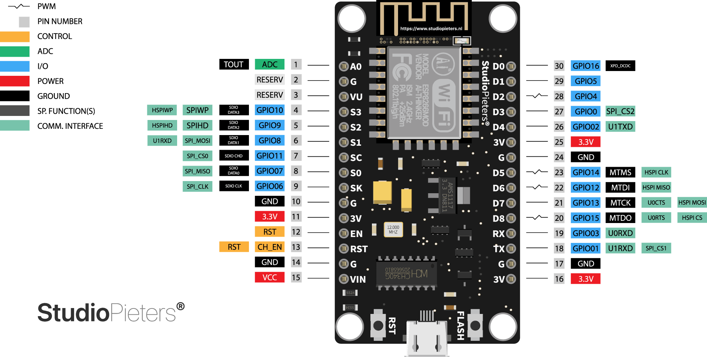

## 2. Acquaintance with NodeMCU and perform essential programming establishment

#### Node MCU feature

 

#### Node MCU pinout diagram

 

#### Node-mcu technical specification

- Micro-controller type: ESP8266-12E 32-bit
- NodeMCU Model: Clone LoLin
- NodeMCU Size: 58mm x 32mm
- Carrier Board Size: n/a
- Pin Spacing: 1.1" (27.94mm)
- Clock Speed: 80 MHz
- USB to Serial: CH340G
- USB Connector: Micro USB
- Operating Voltage: 3.3V
- Input Voltage: 4.5V-10V
- Flash Memory/SRAM: 4 MB / 64 KB
- Digital I/O Pins: 11
- Analog In Pins: 1
- ADC Range: 0-3.3V
- WiFi Built-In: 802.11 b/g/n
- Temperature Range: -40C - 125C
- Frequency range: 2.4 GHz - 2.5 GHz (2400M-2483.5M)
- Wi-Fi mode: Station / SoftAP / SoftAP+station
- Stack: Integrated TCP/IP
- Output power: 19.5dBm in 802.11b mode
- Data interface: UART / HSPI / I2C / I2S / Ir
- Remote Control: GPIO / PWM
- Supports protection mode: WPA / WPA2
- Encryption: WEP / TKIP / AES
- Consumption: with continuous Wi-Fi transmission about 70 mA (200 mA MAX) - in standby < 200µA
- Dimensions (mm): 58×31.20×13
- Weight: 10 grams

### extra

- reference [click me](<https://github.com/joysmith/Shri-Shankaracharya-Technical-Campus/blob/main/5%20sem%20DS(A%20%2B%20B)%20%20-IOT/Resource/project%202%20-nodemcu.pdf>)
