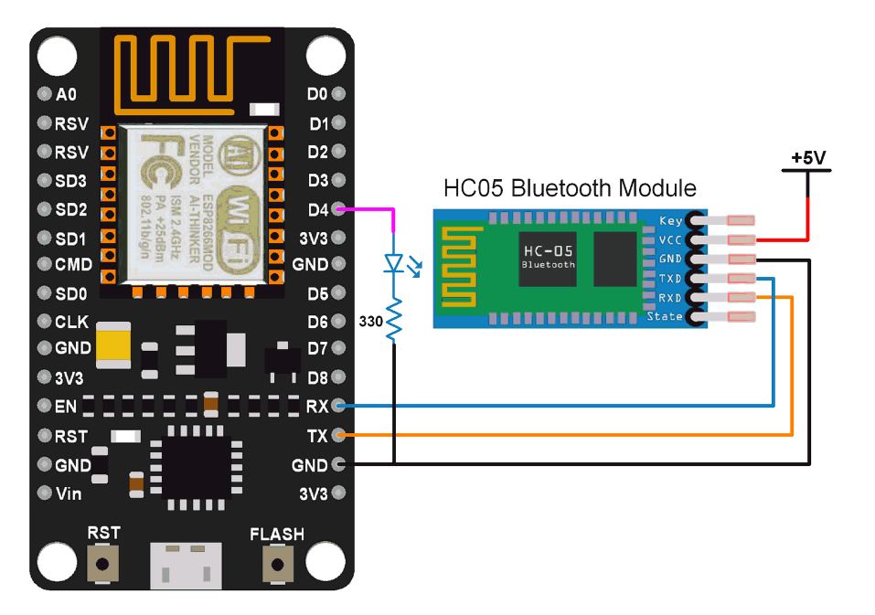

## 8. Communicate Bluetooth with Arduino/ NodeMCU and compose a program to send sensor information to cell phone utilizing Bluetooth.



1. Download bluetooth terminal app[click me](<https://github.com/joysmith/Shri-Shankaracharya-Technical-Campus/blob/main/5%20sem%20DS(A%20%2B%20B)%20%20-IOT/Resource/1%20bluetoothterminal.apk>)
2. Download bluetooth terminal app[click me](<https://github.com/joysmith/Shri-Shankaracharya-Technical-Campus/blob/main/5%20sem%20DS(A%20%2B%20B)%20%20-IOT/Resource/2%20bluetooth%20termianl%20.apk>)

```js
int LED = D4;

void setup() {
 pinMode(LED, OUTPUT);
 Serial.begin(9600); /* Define baud rate for serial communication */
}

void loop() {

 if (Serial.available())  /* If data is available on serial port */
    {
      char data_received;
      data_received = Serial.read();  /* Data received from bluetooth */
      if (data_received == '1')
      {
       digitalWrite(LED, HIGH);
       Serial.write("LED turned ON\n");
      }
      else if (data_received == '2')
      {
       digitalWrite(LED, LOW);
       Serial.write("LED turned OFF\n");
      }
      else
      {
       Serial.write("Select either 1 or 2");
      }
    }
}
```

#### version 2

```js
void setup() {

 pinMode(D0, OUTPUT);
Serial.begin(9600);

}

void loop() {

if (Serial.available()){
  char data;
  data=Serial.read();
  Serial.println(data);

  if (data =='o'){
    digitalWrite(D0,HIGH);
    delay(1000);
  }

  else if(data =='c'){
    digitalWrite(D0,LOW);
    delay(1000);
  }
}

}
```
