## 10. Compose a program on NodeMCU to transfer temperature and stickiness information to thingspeak,Blynk or any other free cloud

- Create thing-speak account [click me](https://thingspeak.mathworks.com/)


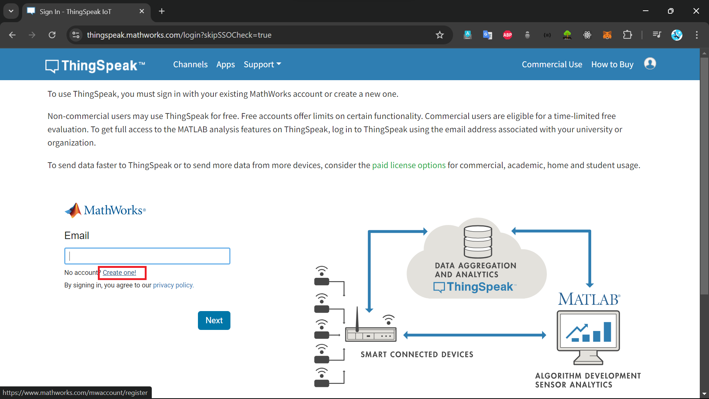

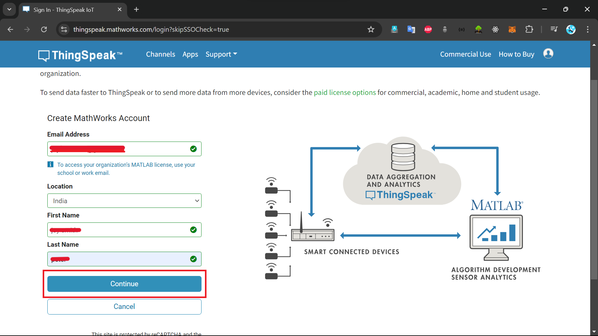

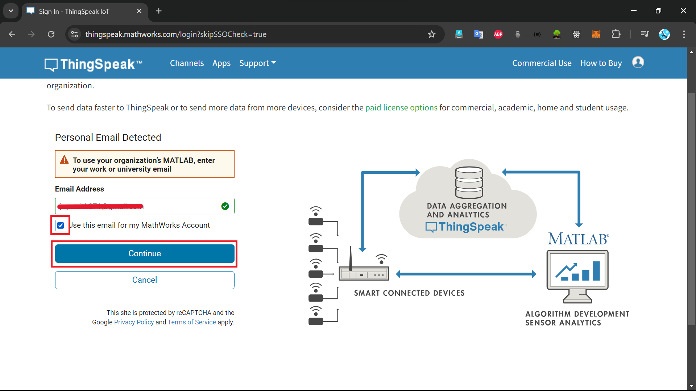

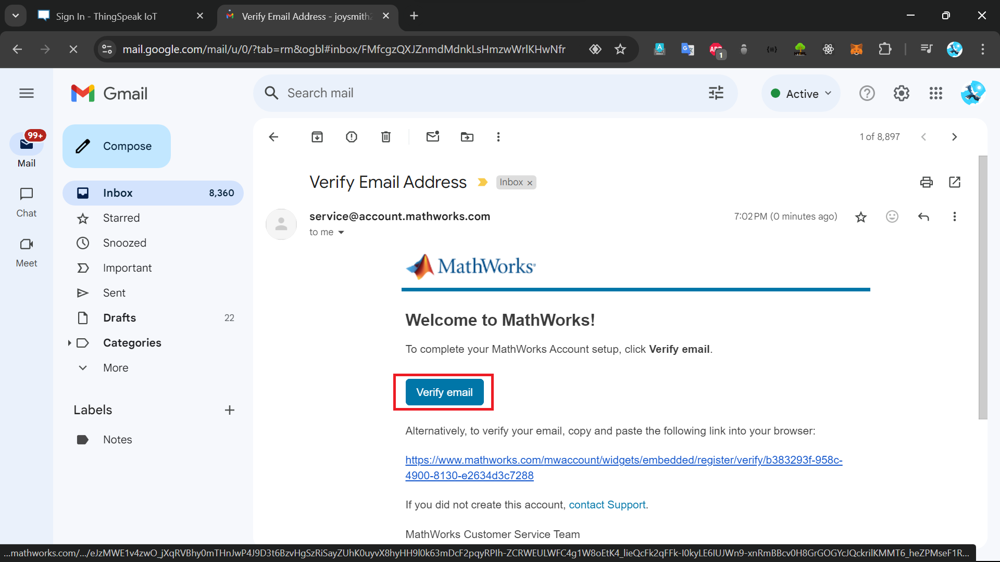

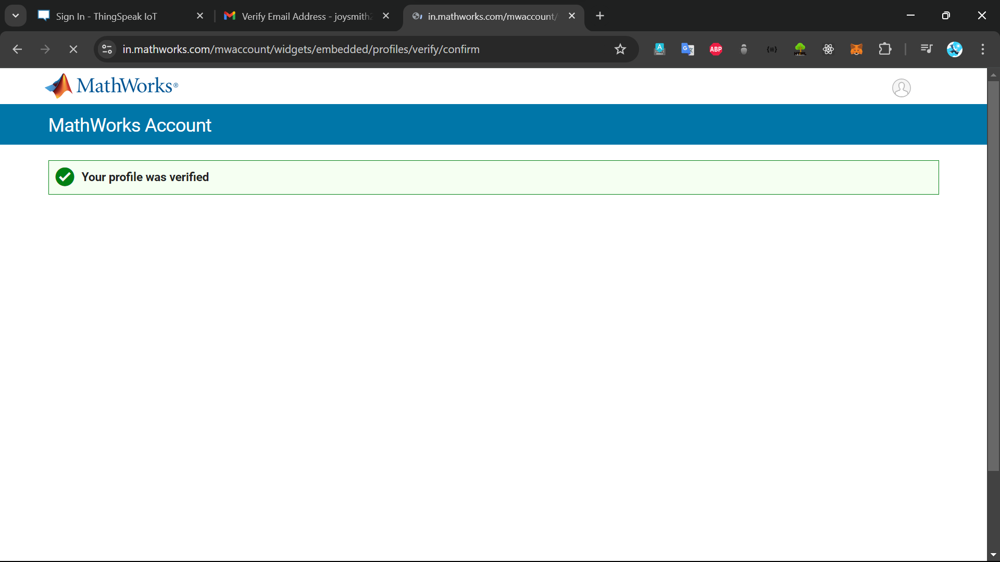

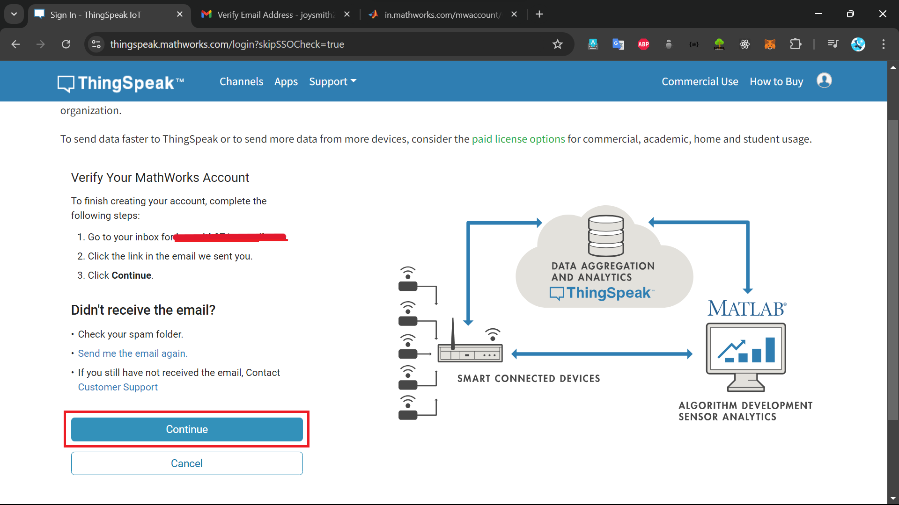

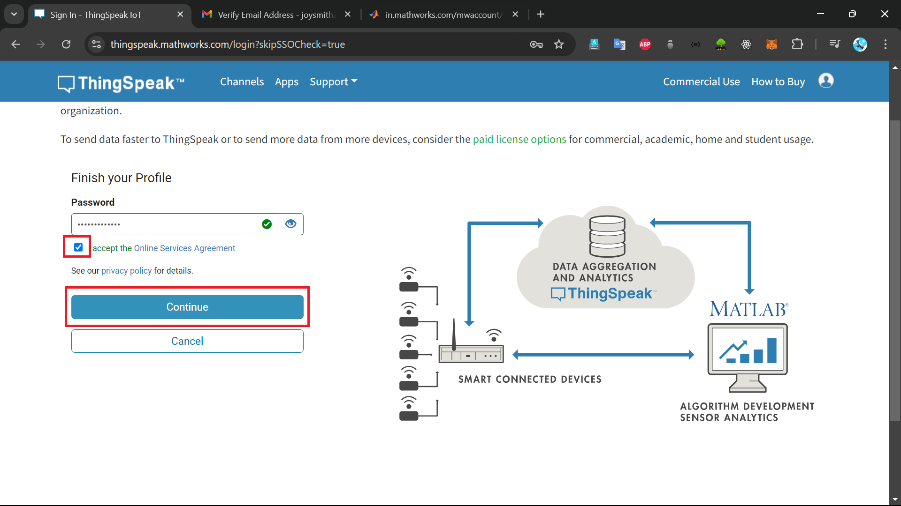

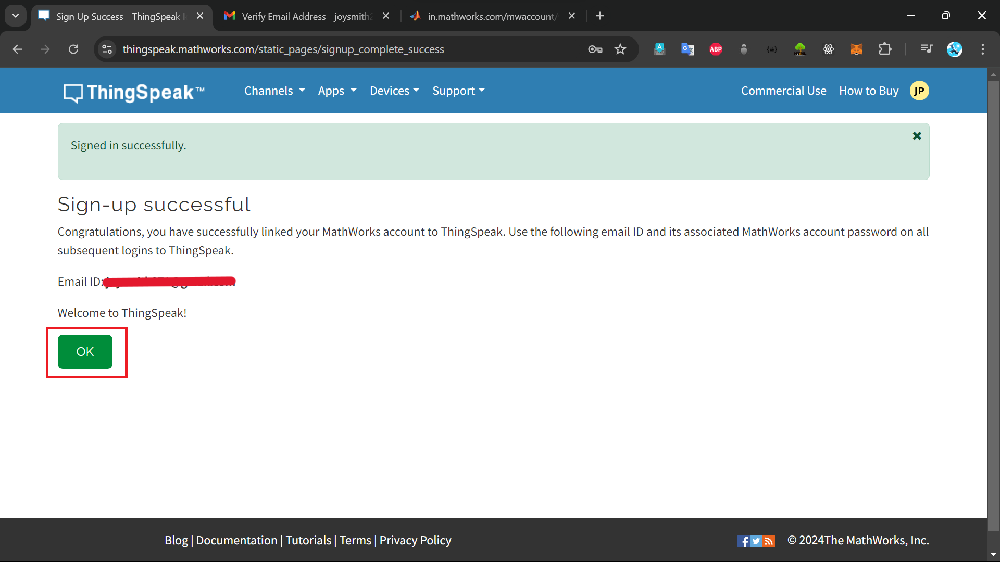

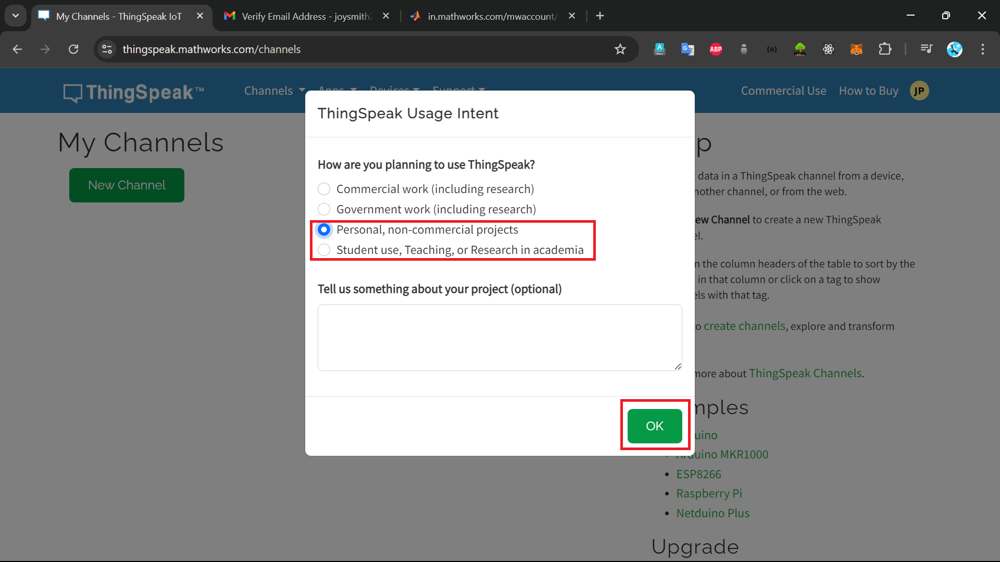

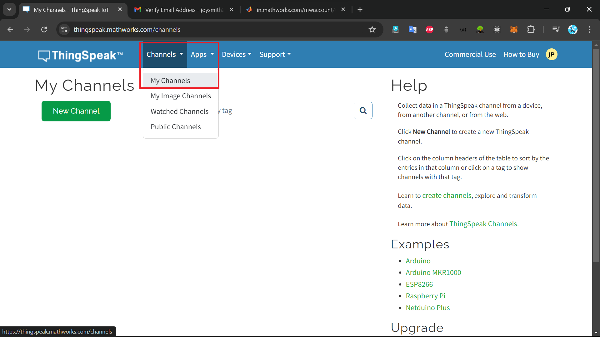

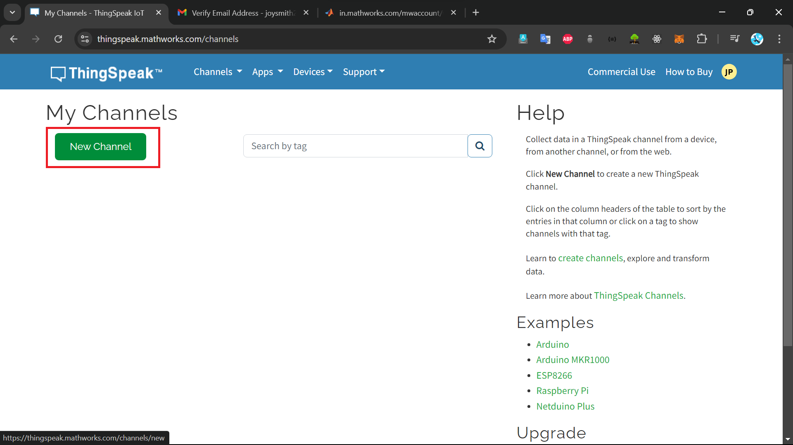

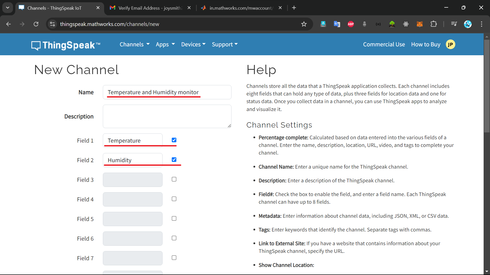

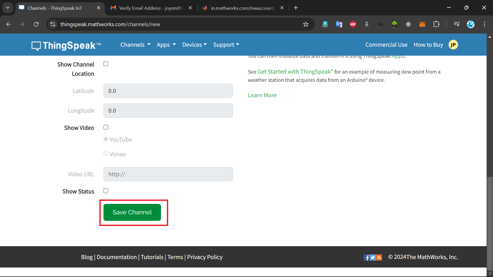

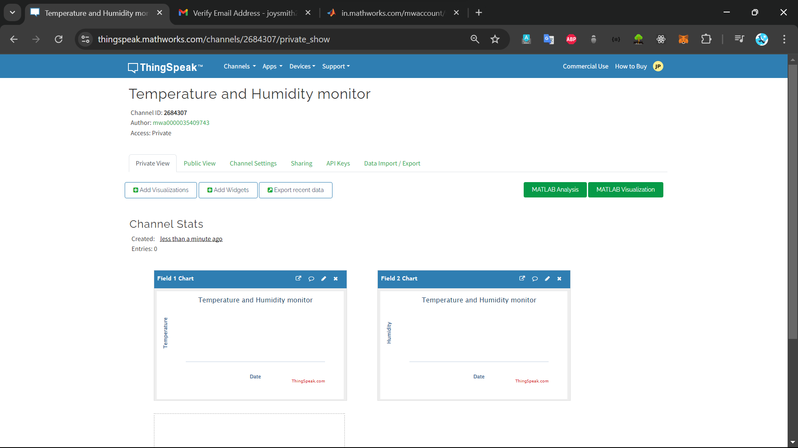

<br>

#### How to install library

Open arduino IDE and follow steps

- Go to sketch--> include library--> manage library--> Search: "DHT11" by adafruit --> install all
- Go to sketch--> include library--> manage library--> Search: "Thingspeak" by mathwork --> install

<br>

#### modify code: write apikey, channel id

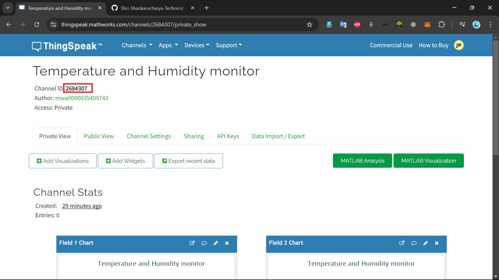

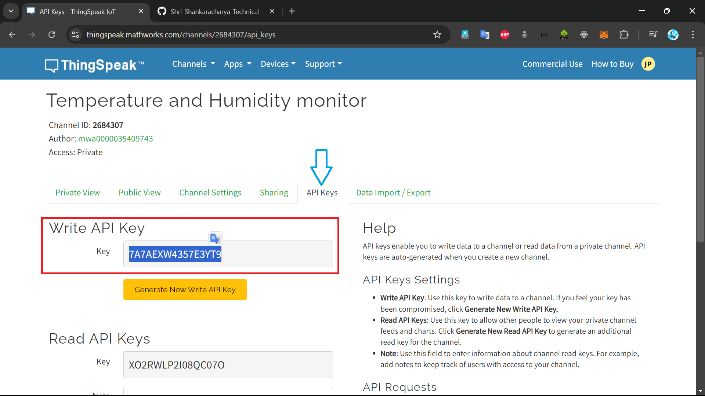

```ino
#include <ESP8266WiFi.h>
#include <DHT.h>
#include <ThingSpeak.h>

DHT dht(D5, DHT11);

WiFiClient client;

// 1️⃣ copy channel number from Thingspeak account
long myChannelNumber = 2684307;

// 2️⃣ get the api Write key from thingspeak account
const char myWriteAPIKey[] = "7A7AEXW4357E3YT9";

void setup() {
  // put your setup code here, to run once:
  Serial.begin(9600);

  // 3️⃣ write your wifi name and password inside double-quote
  WiFi.begin("WiFiname", "password");
  while(WiFi.status() != WL_CONNECTED)
  {
    delay(200);
    Serial.print(".., \n");
  }
  Serial.println();
  Serial.println("NodeMCU is connected!");
  Serial.println(WiFi.localIP());
  dht.begin();
  ThingSpeak.begin(client);
}

void loop() {
  // put your main code here, to run repeatedly:
  float h = dht.readHumidity();
  float t = dht.readTemperature();
  Serial.println("Temperature: " + (String) t);
  Serial.println("Humidity: " + (String) h);

  // Real data uncomment below lines if sensor is connected
 // ThingSpeak.writeField(myChannelNumber, 1, t, myWriteAPIKey);
 // ThingSpeak.writeField(myChannelNumber, 2, h, myWriteAPIKey);

  // dummy data 5 , 9 change these value to see fluctuation on chart
   ThingSpeak.writeField(myChannelNumber, 1, 5, myWriteAPIKey);
   ThingSpeak.writeField(myChannelNumber, 2, 9, myWriteAPIKey);


  // delay(100);
}
```
