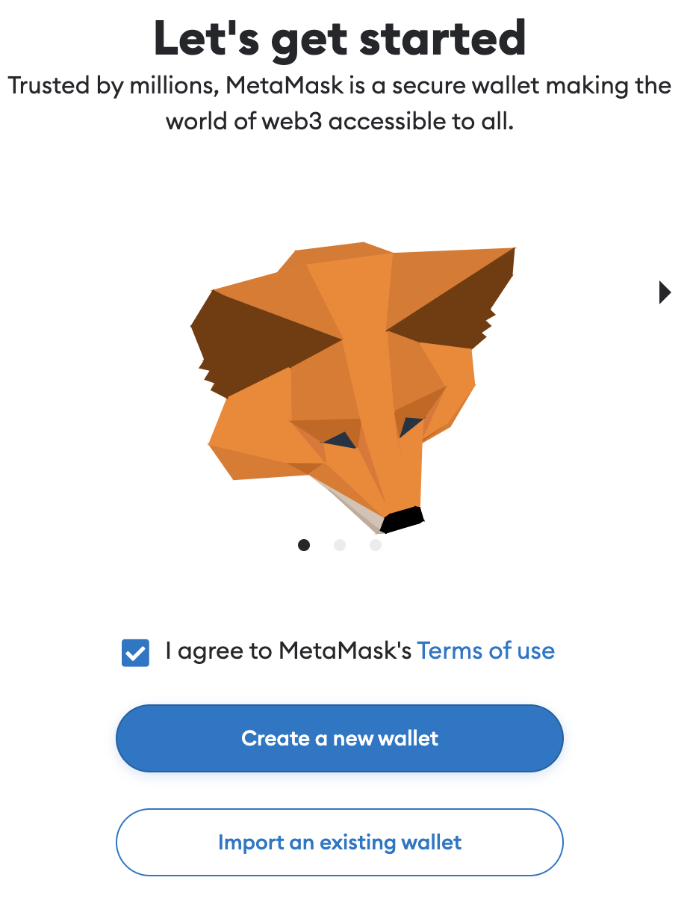
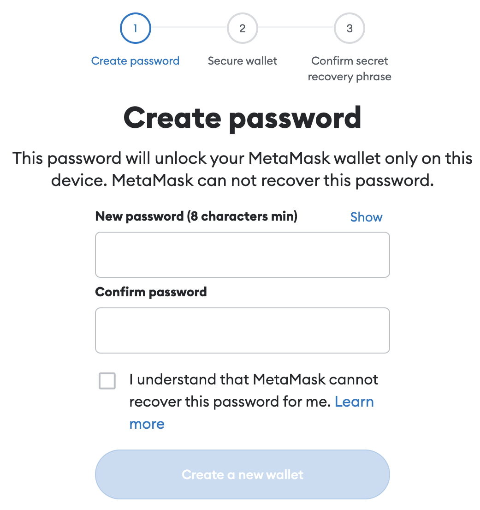
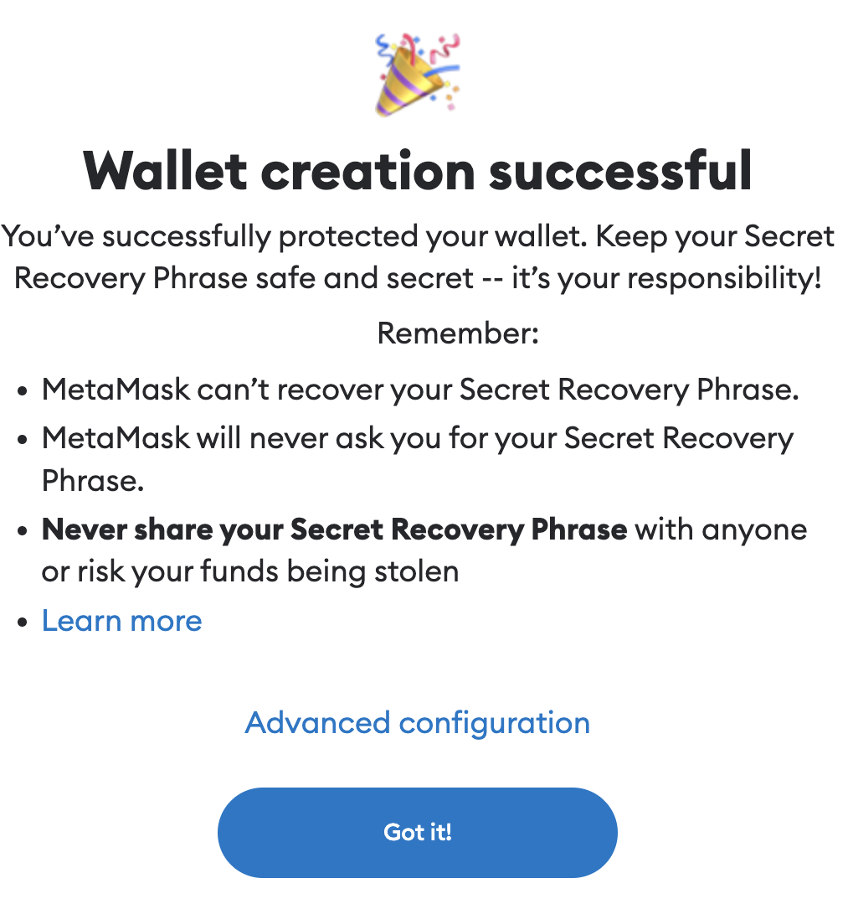
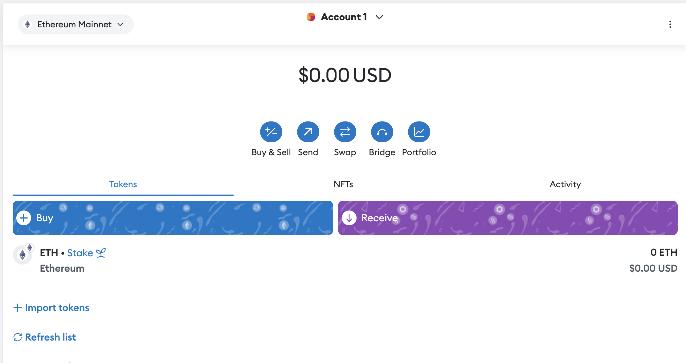
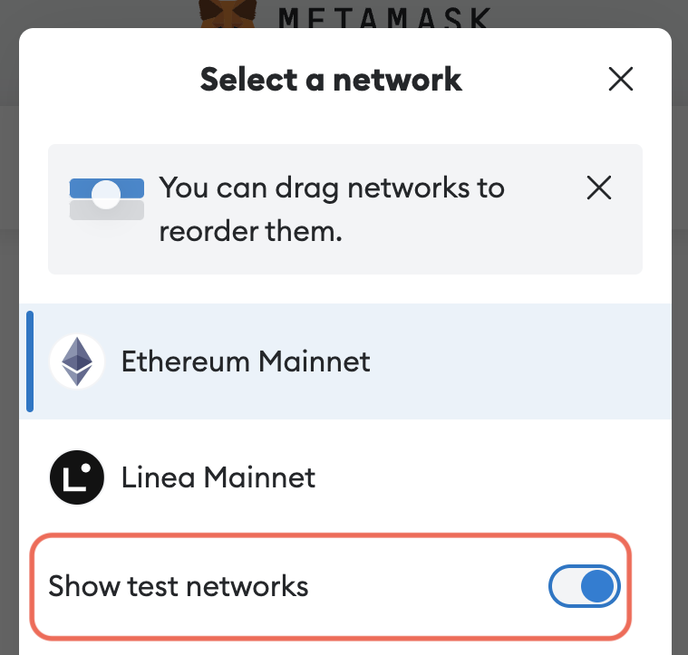
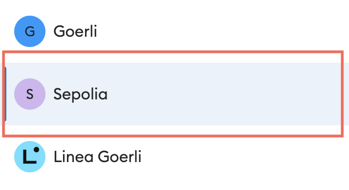

## General Overview of Bitcoins

- [SHA256 Hash Generator](https://passwordsgenerator.net/sha256-hash-generator/)

- [Cryptocurrency Prices by Market Cap](https://coinmarketcap.com/)

- [Block chain transaction latest block details](https://www.blockchain.com/explorer)
  click on latest block--> select any block

- [How nonce value help to generate block](https://demoblockchain.org/block)

---

- Visual block chain [click me](https://andersbrownworth.com/blockchain/hash)

- Load Remix in your browser by visiting this link: [click me](https://remix.ethereum.org/)

```sol
pragma solidity ^0.4.17;

contract Inbox {
    string public message;

    function Inbox(string initialMessage) public {
        message = initialMessage;
    }

    function setMessage(string newMessage) public {
        message = newMessage;
    }

    function getMessage() public view returns (string) {
        return message;
    }

}
```

#### Metamask Setup and Configuration

This lecture will provide instructions for setting up the Metamask extension in your browser.

1. First, install the extension for your specific browser (Chrome or Firefox recommended): [click me](https://metamask.io/download/)

2. After the extension has been installed, a modal should automatically pop up in your browser. Check the I Agree box and click the Create a new wallet button.



3. Agree or Decline the Help us improve Metamask question.

4. Create a password for your Metamask wallet and then click the Create a new wallet button.



5. Click the Secure my wallet button

6. Click the Reveal seed phrase button. Copy this 12-word mnemonic (recovery phrase) to a secure place. Then, click the Next button.

7. Use the phrase copied in the previous step to complete the Confirm Secret Recovery Phrase form. Click Confirm when finished.

8. You should get a success message. If so, click the Got it! button.



9. Click the Next button on the install is complete screen and then click Done.

10. Exit out of any advertisements and you should now be at the Metamask dashboard.



11. Click Ethereum Mainnet in the top left corner to open the Select a Network menu and toggle Show test networks to on.



12. You will need to select the Sepolia network. This is what we will use throughout the course (the video lectures may reference the Rinkeby network which has since been deprecated).



13. You can now close out the setup page and interact directly with the extension in your browser. If you have the correct network selected (Sepolia), you should see an S in the top left corner of the extension window.

---

#### Getting Test Ether to Use in the Course

Before continuing to the next lecture, we will need to obtain some test Ether!

Due to the recent merge the Rinkeby Network no longer exists. For a short time, we used the Goerli network for everything in this course. This too was deprecated as of January 2023. Now, we will use the Sepolia Network. This is 100% interchangeable with Rinkeby and Goerli, so, there will be no actual difference.

Since we will be using the Sepolia Network, we will need to use a Sepolia faucet to obtain test ether. Nearly all current faucets require some level of authentication to protect against DOS attacks and bots. Most faucets now require that you have real mainnet Ether to even request testnet Ether.

Option #1
Ethereum Sepolia Faucet

1. Visit [click me](https://cloud.google.com/application/web3/faucet/ethereum/sepolia)

2. Enter your Metamask wallet address and click the Recieve button.

Your wallet should eventually receive .05 ether. You will only be able to request ether once a day, so, you should try to do this a few times over the span of a few days.

Option #2
Sepolia PoW Faucet
This faucet is very reputable and hosted by a well-known blockchain development company. They will require that you already have 0.001 of real mainnet Ether in wallet.

We do not recommend using a wallet with real money. Instead, create a new wallet for development purposes and transfer 0.001 Ether from your real wallet to your dev wallet.

After securing the required mainnet Ether, please see the following instructions:

1. Register for an Alchemy account: [click me](https://auth.alchemy.com/signup)

2. After registering, visit [click me](https://www.alchemy.com/faucets/ethereum-sepolia)

3. Enter your Metamask wallet address and check the I Am Not a Robot captcha.

4. You should receive a notification that the transfer was successful with a link to the transaction.

Option #3
Sepolia PoW Faucet
This faucet requires you to perform a simple mining task. However, they now also require users to prove their trustworthiness by registering for a Gitcoin Passport:

https://passport.gitcoin.co

This will require connecting some personal accounts to Passport. We are leaving this here as an option, however, we assume that many students will not want to perform these steps.

After completing the Passport verification, to obtain test Ether, please see the following instructions:

1. Visit [click me](https://sepolia-faucet.pk910.de/)

2. Enter your Metamask wallet address and check the I Am Human captcha.

3. Click Start Mining

4. You will need to obtain at least 0.05 Ether to collect your reward.

5. When you have a sufficient amount, click the Stop Mining and Claim Rewards button.

6. You should receive a notification that the transfer was successful with a link to the transaction.

The mining used in this faucet is used only as a check against bots and bad users:

The hashpower is not used to compute anything useful that requires a huge amount of processing time. It's only a protection method that relies on the fact that every user is limited by the same technology.

If you would like to read more about this faucet you can check out their Wiki docs: [click me](https://github.com/pk910/PoWFaucet/wiki)

---
