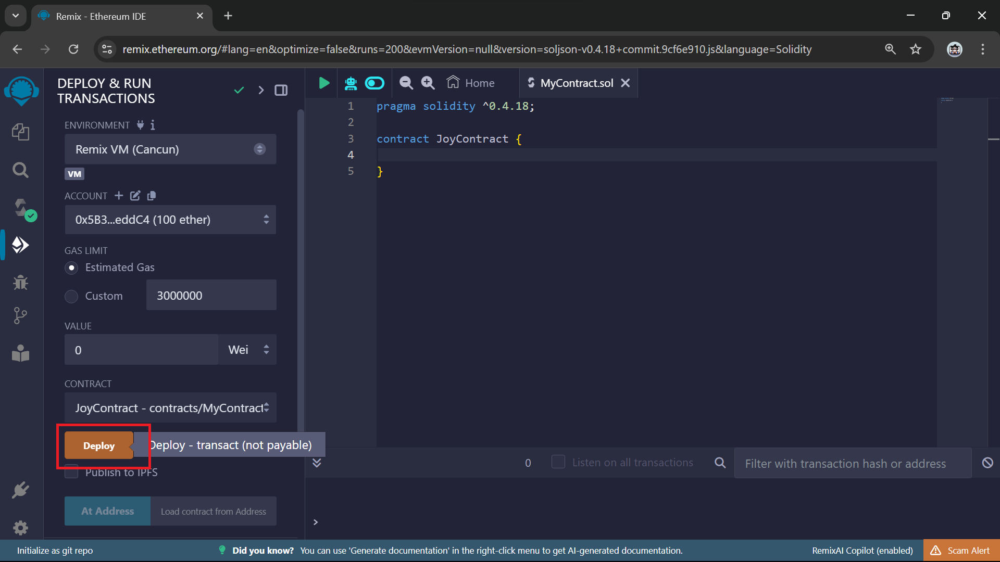

```js
pragma solidity ^0.4.18;
```

<br>


```js
pragma solidity ^0.4.18;

contract JoyContract {

}
```

<br>





```js
pragma solidity ^0.4.18;

contract JoyContract {
    string name = "joy peter";
    uint age = 70;
}
```

<br>


```js
pragma solidity ^0.4.18;

contract JoyContract {
    string public name = "joy peter";
    uint public age = 70;

}
```

<br>


```js
pragma solidity ^0.4.18;

contract JoyContract {
    string name;
    uint age;

    // constructor function
     function JoyContract () public {
        name = "joy peter";
        age = 70;
    }

}
```

<br>


```js
pragma solidity ^0.4.18;

contract JoyContract {
    string name;
    uint age;

    // constructor function
     function JoyContract () public {
        name = "joy peter";
        age = 70;
    }

    // setter
    function setMessage(string _name, uint _age) public {
        name = _name;
        age = _age;
    }

    // getter
    function getMessage() public view returns (string, uint) {
        return (name,age);
    }

}
```

<br>


