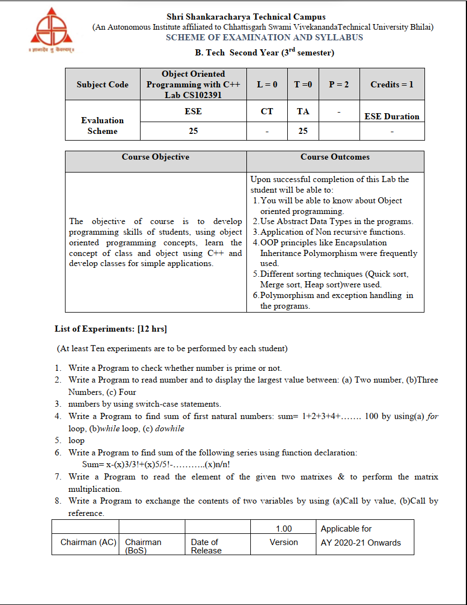
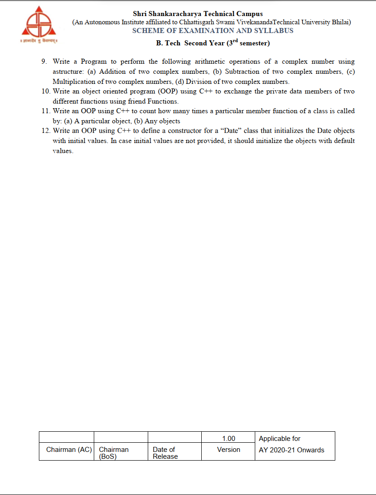

# Object Oriented Programming with C++, Lab CS102391

   
  
<br>
<br>

### 1. Write a Program to check whether number is prime or no

A prime number is a natural number that has only one and itself as factors. This C++ program used to demonstrates how to find out whether a natural number is prime or not.

```c++
#include <iostream>
using namespace std;

int main()
{
    /* variable definition and initialization */
    int n, i, c = 0;

    /* Get user input */
    cout << "Enter any number n: "; cin>>n;

    /*logic*/
    for (i = 1; i <= n; i++)
    {
        if (n % i == 0)
        {
           c++;
        }
    }
    if (c == 2)
    {
       cout << "n is a Prime number" << endl;
    }
    else
    {
         cout << "n is not a Prime number" << endl;
    }
    return 0;
}
```

A prime number is a natural number that has only one and itself as factors. This C++ program used to demonstrates how to find out whether a natural number is prime or not.

Examples: 2, 3, 13 are prime numbers.

#include <iostream>
using namespace std;

int main()
{
/_ variable definition and initialization _/  
 int n, i, c = 0;

    /* Get user input */
    cout << "Enter any number n: "; cin>>n;

    /*logic*/
    for (i = 1; i <= n; i++)
    {
        if (n % i == 0)
        {
           c++;
        }
    }
    if (c == 2)
    {
       cout << "n is a Prime number" << endl;
    }
    else
    {
         cout << "n is not a Prime number" << endl;
    }
    return 0;

}

First of all, you have to include the iostream header file using the "include" preceding by # which tells that hat the header file needs to be process before compilation, hence named preprocessor directive. Now, for removing naming conflict you can use namespace statement within a program.

Next, you have to declare three integer type variables 'n', 'i', 'c' and initialize c as 0. Now tell the user to enter any natural number n, using the cout<<""; statement. The 'cin<<' statement will take value from the input device, (here keyboard) and store it to the variable n. Now you have to implement a for - loop which will count from 1 up to n. And within this loop checks whether n divides with i gives value equals to 0 or not. If the condition becomes true increments the value of c.

Now when c == 2, prints that "n is a Prime number" and if c is having value other than 2, prints that "n is not a Prime number". And finally the return 0; statement is used to return an integer type value back to main().
