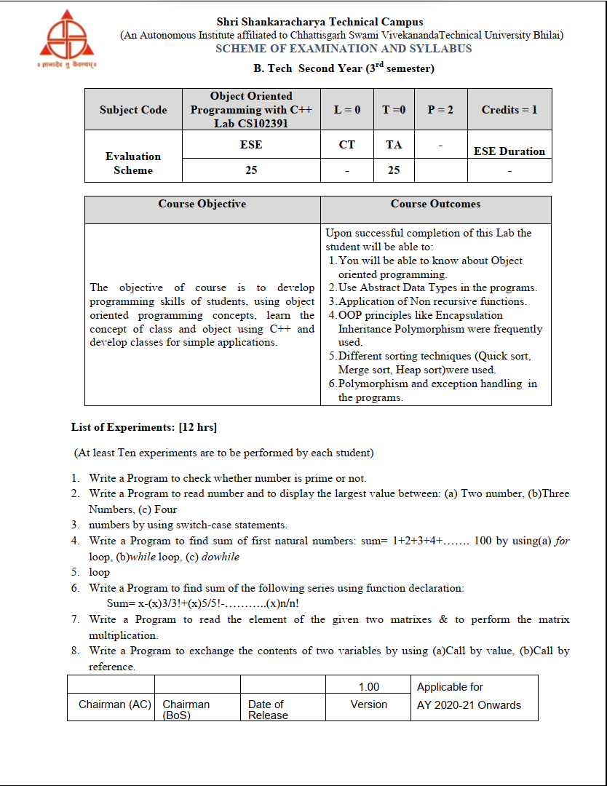
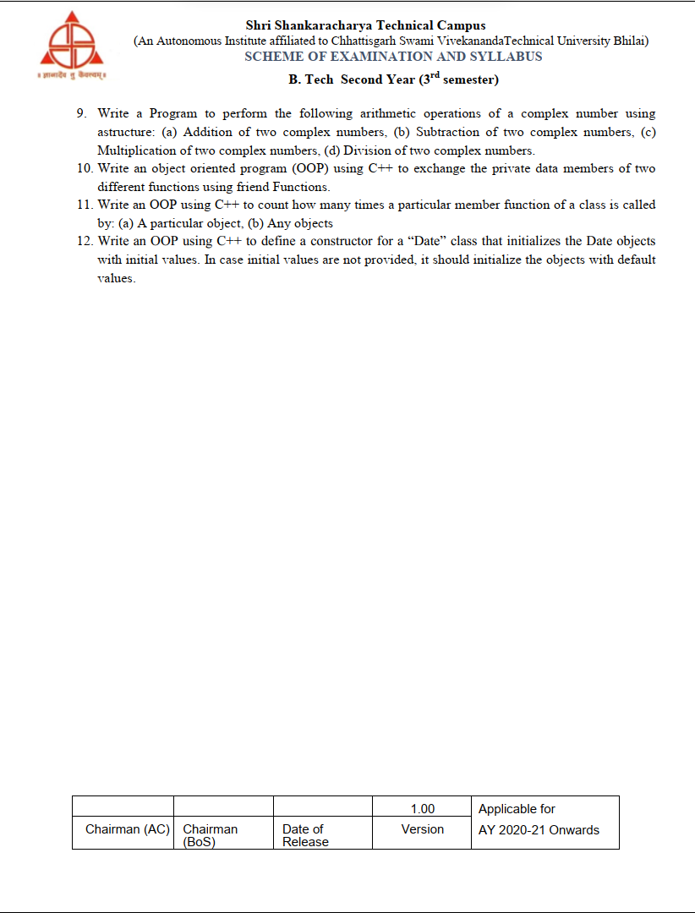

# Object Oriented Programming with C++, Lab CS102391

   
  
<br>
<br>

# Experiment 01

## 1. Write a Program to check whether number is prime or no

A prime number is a natural number that has only one and itself as factors. This C++ program used to demonstrates how to find out whether a natural number is prime or not.

Examples: 2, 3, 13 are prime numbers.

- [how to find prime number 1-100 ](https://www.youtube.com/shorts/uPpLTegQ6Nc)

```c++
#include <iostream>
using namespace std;

int main() {

  int i, n;
  bool is_prime = true;

  cout << "Enter a positive integer: ";
  cin >> n;

  // 0 and 1 are not prime numbers
  if (n == 0 || n == 1) {
    is_prime = false;
  }

  // loop to check if n is prime
  for (i = 2; i <= n/2; ++i) {
    if (n % i == 0) {
      is_prime = false;
      break;
    }
  }

  if (is_prime)
    cout << n << " is a prime number";
  else
    cout << n << " is not a prime number";

  return 0;
}

```

# Experiment 02

## 2. Write a Program to read number and to display the largest value between:

(a) Two number

```c++
// C++ Program to Find Largest of Two Numbers
#include <iostream>
using namespace std;
int main(){
    int x, y;

    // Asking for input
    cout << "Enter the first number: ";
    cin >> x;
    cout << "Enter the second number: ";
    cin >> y;

    if (x > y){
        cout << x << " is greater than " << y;
    }
    else if (y > x){
        cout << y << " is greater than " << x;
    }
    else{
        cout << "Both are equal";
    }
    return 0;
}
```

---

(b)Three Numbers

```c++
// C++ Program to Find Largest of Three Numbers

#include <iostream>
using namespace std;

int main() {

    double n1, n2, n3;

    cout << "Enter three numbers: ";
    cin >> n1 >> n2 >> n3;

    // check if n1 is the largest number
    if(n1 >= n2 && n1 >= n3)
        cout << "Largest number: " << n1;

    // check if n2 is the largest number
    else if(n2 >= n1 && n2 >= n3)
        cout << "Largest number: " << n2;

    // if neither n1 nor n2 are the largest, n3 is the largest
    else
        cout << "Largest number: " << n3;

    return 0;
}
```

---

(c) Four

```c++
// C++ Program to Find Largest of Four Numbers

#include <iostream>
using namespace std;
int max(int x, int y){
    if(x > y){
        return x;
    }else{
        return y;
    }
}
int main(){
    double n1, n2, n3, n4;

    cout << "Enter three numbers: ";
    cin >> n1 >> n2 >> n3 >> n4;

    int a = 75, b = 18, c = 25, d = 98;
    int left_max = max(n1, n2);
    int right_max = max(n3, n4);
    int final_max = max(left_max, right_max);
    cout << "Largest number: " << final_max;
}
```

---

# Experiment 03

## Write a program to find sum of first natural number: sum = 1+2+3 ... 100 by using for and while loop

1 For loop

```cpp

#include <iostream>
using namespace std;

class Natural{
private:
    int res;

public:
    void loop(){
        res = 0;
        for(int i = 1; i<=100; i++){
            res = res + i;
        }

        cout << "The sum of all natural number is " << res;
    }
};


int main(){
    Natural obj;
    obj.loop();
    return 0;
}

// output
// The sum of all natural number is 5050
```

2. While loop

```cpp
#include <iostream>
using namespace std;

class Natural{
private:
    int res;

public:
    void loop(){
        int i = 1;
        res = 0;

        while(i <= 100){
            res = res + i;
            i++;
        }

        cout << "The sum of all natural number is " << res;
    }
};


int main(){
    Natural obj;
    obj.loop();
    return 0;
}

// output
// The sum of all natural number is 5050
```

---

# Experiment 04

## Write a program to find sum of the following series using function declaration:

🔴 output wrong

```cpp
#include <iostream>
using namespace std;

int power(int, int);
int fact(int);

int main(){
    int x, n, sign = 1;
    float sum = 0;

    cout << "Enter the value of x = " << endl;
    cin >> x;
    cout << "Enter the value of n = " << endl;
    cin >> n;

    for(int i=1; i<=n; i=i+2){
        sign =1;
        if(sign%2 != 0){
            cout << "+" << power(x, i) << "/" << fact(i);
        }else{
            cout << "-" << power(x, i) << "/" << fact(i);
        }
        sign++;
    }

    for(int i=1; i<=n; i=i+2){
        sign = 1;
        if(sign%2 != 0 ){
            sum = sum + power(x, i)/fact(i);
        }else{
            sum = sum - power(x, i)/fact(i);
            sign++;
        }

        cout << endl << "The sum is" << sum;
        return 0;
    }
}

int power(int b, int c){
    int i, p=1;
    for(i=1; i<=c; i++){
        p = p*b;
    }
    return p;
}

int fact(int x){
    int f =1;
    int i;
    for(i=1; i<=x; i++){
        f = f * i;
    }
    return f;
}

// output
//    Enter the value of x =
//    3
//    Enter the value of n =
//    3
//    +3/1+27/6
//    The sum is 7
```

# Experiment 05

## Write a program to read the element of the given two matrix and to perform the matrix multiplication

```cpp
#include <iostream>
using namespace std;

class Matrix{
private:
    int a[10][10], b[10][10], mul[10][10];
    int r, c, i, j, k;

public:
    void process(){
        cout << "Enter the number of Row = " << endl;
        cin >> r;

        cout << "Enter the number of Column = " << endl;
        cin >> c;

        cout << "Enter the first matrix element = " << endl;
        for(i=0; i<r; i++){
            for(j=0; j<c; j++){
                cin >> a[i][j];
            }
        }

        cout << "Enter the second matrix element " << endl;
        for(i=0; i<r; i++){
            for(j=0; j<c; j++){
                cin >> b[i][j];
            }
        }

        cout << "Multiply of the matrix: " << endl;

        for( i=0; i<r; i++){
            for(j=0; j<c; j++){
                mul[i][j] = 0;
                for(k=0; k<c; k++){
                    mul[i][j] += a[i][k] * b[k][j];
                }
            }
        }


        for(i=0; i<r; i++){
            for(j=0; j<c; j++){
                cout << mul[i][j] << " ";
            }
            cout << endl;
        }
    }
};

int main(){
    Matrix obj;
    obj.process();
    return 0;
}

// output
//    Enter the number of Row =
//    3
//    Enter the number of Column =
//    3
//    Enter the first matrix element =
//    1
//    2
//    3
//    4
//    5
//    6
//    7
//    8
//    9
//    Enter the second matrix element
//    1
//    2
//    3
//    4
//    5
//    6
//    7
//    8
//    9
//    Multiply of the matrix:
//    30 36 42
//    66 81 96
//    102 126 150
```

# Experiment 06

## Write a program to exchange the content of two variable by using a: call by value. b:call by reference

a) Call by value

```cpp
#include <iostream>
using namespace std;

void swap(int , int);

int main(){
    int a, b;
    cout << "Enter the value of a and b " << endl;
    cin >> a >> b;
    cout << "Before swapping: " << endl;
    cout << "The value of a is " << a << endl;
    cout << "The value of b is " << b << endl;

    swap(a, b);


    return 0;
}

void swap(int a, int b){
    int temp = a;
    a = b;
    b = temp;

    cout << "After swapping: " << endl;
    cout << "The value of a is " << a << endl;
    cout << "The value of b is " << b << endl;
}

// output
//    Enter the value of a and b
//    1
//    2
//    Before swapping:
//    The value of a is 1
//    The value of b is 2
//    After swapping:
//    The value of a is 2
//    The value of b is 1
```

---

b) Call by reference

```cpp
#include <iostream>
using namespace std;

void swap(int& , int&);

int main(){
    int a, b;
    cout << "Enter the value of a and b " << endl;
    cin >> a >> b;
    cout << "Before swapping: " << endl;
    cout << "The value of a is " << a << endl;
    cout << "The value of b is " << b << endl;

    swap(a, b);
    cout << "After swapping: " << endl;
    cout << "The value of a is " << a << endl;
    cout << "The value of b is " << b << endl;

    return 0;
}

void swap(int &a, int &b){
    int temp = a;
    a = b;
    b = temp;


}

// output
//    Enter the value of a and b
//    1
//    2
//    Before swapping:
//    The value of a is 1
//    The value of b is 2
//    After swapping:
//    The value of a is 2
//    The value of b is 1
```

# Experiment 07

## Write a program ti perform the following arithmetic operations of a complex number using a structure

1. addition of 2 complex number
1. subtraction of 2 complex number
1. multiplication of 2 complex number
1. division of 2 complex number

# Experiment 08

## Write an OOP using C++ to exchange the private data member of 2 different function using friend function

# Experiment 09

## Write an OOP using C++ to count how many time a particular function of class is called

```cpp
#include <iostream>
using namespace std;

class Check{
public:
    static int count;

    void process(){
        count++;
    }
};

int Check::count = 0;

int main(){
    Check obj;
    obj.process();
    obj.process();
    obj.process();
    obj.process();

    Check obj1;
    obj1.process();
    obj1.process();
    obj1.process();
    obj1.process();

    cout << Check::count << endl;
    return 0;
}

void swap(int &a, int &b){
    int temp = a;
    a = b;
    b = temp;


}

// output
// 8
```

# Experiment 10

## Write an OOP using C++ to define a constructor for a "Data" class that initialize the data object with initialize value In case initial value are not provided, it should initialize the objects with default values

```cpp
#include <iostream>
using namespace std;

class Date{
    int dd, mm, yy;
public:
    Date(){
        dd = 24;
        mm = 12;
        yy = 23;
    }

    void input(){
        cout << "enter date: ";
        cin >> dd;

        cout << "enter month: ";
        cin >> mm;

        cout << "enter year: ";
        cin >> yy;
    }

    void output(){
        cout << "DD-MM-YY :: " << dd << "-" << mm << "-" << yy << endl;
    }
};

int main(){
    Date obj;
    obj.input();
    obj.output();
    return 0;
}


// output
//    enter date:6
//    enter month:12
//    enter year:2023
//    DD-MM-YY :: 6-12-2023
```
